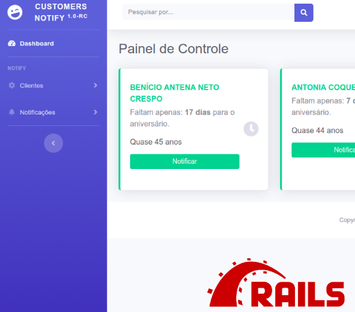
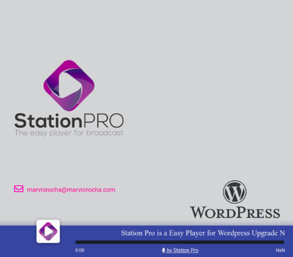

<!-- Main -->

<!-- One -->
<section id="one">
	

		<header class="major">
			<h2>Applications</h2>
		</header>
		
Some any projects and ideas 

	

</section>

<!-- Two -->
<section id="two" class="spotlights">
	<section>
		
		

			

				<header class="major">
					<h3>Customers Notification</h3>
				</header>
				
That is a application build in ruby on rails and javascript with clean code easy to use. 

                
<b>user:</b> admin@admin.com   <b>password:</b> admin123 

				<ul class="actions">
					<li><a target="_blank" href="https://notifycustomers.herokuapp.com" class="button">Open website</a></li>
				</ul>
			

		

	</section>
	<section>
		
		

			

				<header class="major">
					<h3>Station Pro</h3>
				</header>
				
Station Pro is a plugin for streming the online Station for user build player in your wordpress website

				<ul class="actions">
					<li><a href="http://stationpro.marviorocha.com" class="button">Learn more</a></li>
				</ul>
			

		

	</section>
 
</section>

<!-- Three -->

<!-- other time we editar it -->
<!-- <section id="three">
	

		<header class="major">
			<h2>Others application</h2>
		</header>
		
Nullam et orci eu lorem consequat tincidunt vivamus et sagittis libero. Mauris aliquet magna magna sed nunc rhoncus pharetra. Pellentesque condimentum sem. In efficitur ligula tate urna. Maecenas laoreet massa vel lacinia pellentesque lorem ipsum dolor. Nullam et orci eu lorem consequat tincidunt. Vivamus et sagittis libero. Mauris aliquet magna magna sed nunc rhoncus amet pharetra et feugiat tempus.

		<ul class="actions">
			<li><a href="generic.html" class="button next">Get Started</a></li>
		</ul>
	

</section> -->

